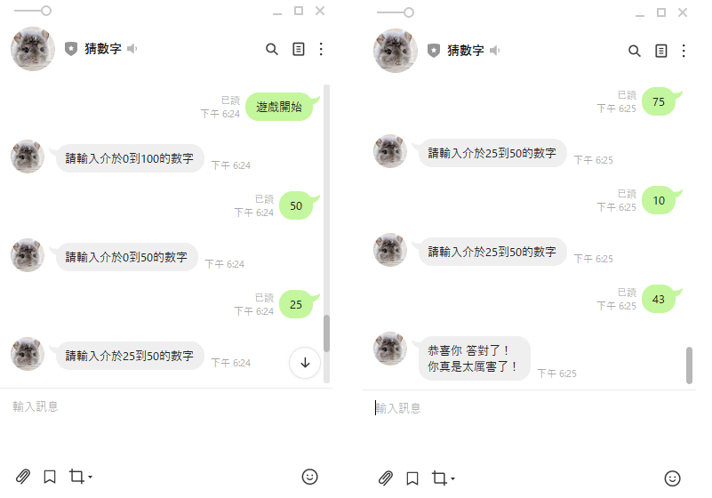

# 猜數字遊戲

## 成果展示

### 搭配 Line-bot 做出猜數字的遊戲 玩家可以透過 Line 平台與機器人進行對話和互動
1. 遊戲開始：系統產生一個 1 ~ 100 的隨機亂數 讓使用者去猜測
2. 遊戲中： 玩家輸入範圍內的數字 判斷是否猜測到最終數字
    * 若猜中 顯示 恭喜你 答對了！你真是太厲害了！ 並開啟新的一場遊戲
    * 若沒中 顯示 新的範圍提供給玩家參考
    * 若玩家輸入的不是數字或是超出範圍 顯示數字應該落在的範圍提供給玩家參考

## 實作步驟
1. 使用 Line 帳號 創立 Messaging API [Line-developers](https://developers.line.biz/zh-hant/)
2. 點選 Messaging API 找到 QR Code 加入好友
3. 點選 Basic settings > Line official Account Manager 開啟新視窗後 點選 回應設定 將 Webhook 打開 自動回應訊息關起來
4. 使用 Google 帳號 建立 pythonanywhere 會員 [Pythonanywhere](https://www.pythonanywhere.com/)
5. 安裝 Line-bot-sdk 模組
```
    pip install line-bot-sdk
```
6. 複製[參考附件](#參考附件-line-bot-sdk)中的程式碼 貼到 app.py 接著將裡面的 'YOUR_CHANNEL_ACCESS_TOKEN' && 'YOUR_CHANNEL_SECRET' 換成 Line-bot 產生的 CHANNEL_ACCESS_TOKEN 和 Channel Secret   
CHANNEL_ACCESS_TOKEN 在 Messaging API 的最下面 按下 issue 後會產生出來  
Channel Secret 在 Basic settings 最下方往上數第 4 個 不用按 issue
7. 點選 Messaging API 找到 Webhook URL 貼上 記得要是 https 才行
``` 
https://{你的 Pythonanywhere 用戶名稱}.pythonanywhere.com/callback
```
8. 此時在聊天室打任何文字 機器人應該都會回傳一樣的文字回來
9. 開始修改程式碼

## 觀念說明
1. 檔案應用說明
``` python
f = open('Myfile.txt','r') # 讀取 ※找不到檔案時會直接報錯
data = f.read()            # 將讀出來的資料存到 data 裡
f = open('Myfile.txt','w') # 清空後寫入 ※找不到檔案時會自動創建
f.write('寫入的資料 類型必須是字串') #兩個參數以上時 請先預處理
f.close() #關閉開啟的檔案
#可以改寫成
with open("myFile","w") as f:
    #內縮程式區塊
    #這種方式不需關閉檔案 默認執行完後自動關閉
```
2. 亂數說明
``` python
import random
print(random.randint(1,10))
#隨機產生介於1~10的整數亂數
```
3. map函數說明
``` python
map(function, list)
function 函數名稱 不需() 可是匿名函數
list 只要是 iterable object 都可以
※ 注意一個重點！ python3 之後 map 回傳的是 「map object」，請用 list 再轉成你看得懂的型態
map(int,input().split())
# 將字串使用空格分割後 每個元素都轉換成 整數資料型態

print(list(map(int,input().split())))
# 將上面做的轉成串列後輸出
```

## 參考附件 [Line-bot-sdk](https://github.com/line/line-bot-sdk-python)
``` python 
    from flask import Flask, request, abort

    from linebot import (
        LineBotApi, WebhookHandler
    )
    from linebot.exceptions import (
        InvalidSignatureError
    )
    from linebot.models import (
        MessageEvent, TextMessage, TextSendMessage,
    )

    app = Flask(__name__)

    line_bot_api = LineBotApi('YOUR_CHANNEL_ACCESS_TOKEN')
    handler = WebhookHandler('YOUR_CHANNEL_SECRET')


    @app.route("/callback", methods=['POST'])
    def callback():
        # get X-Line-Signature header value
        signature = request.headers['X-Line-Signature']

        # get request body as text
        body = request.get_data(as_text=True)
        app.logger.info("Request body: " + body)

        # handle webhook body
        try:
            handler.handle(body, signature)
        except InvalidSignatureError:
            print("Invalid signature. Please check your channel access token/channel secret.")
            abort(400)

        return 'OK'


    @handler.add(MessageEvent, message=TextMessage)
    def handle_message(event):
        line_bot_api.reply_message(
            event.reply_token,
            TextSendMessage(text=event.message.text))


    if __name__ == "__main__":
        app.run()
```

